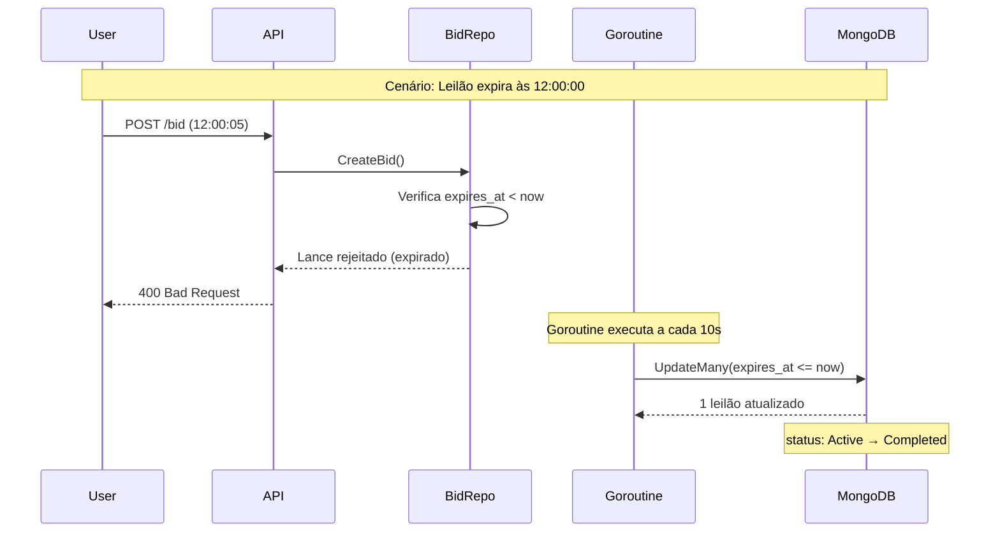

# Sistema de Leilão - Go Expert

API REST para gerenciamento de leilões desenvolvida em Go, seguindo princípios de Clean Architecture.

## 🚀 Tecnologias

- **Go 1.25** - Linguagem de programação
- **Gin** - Framework web HTTP
- **MongoDB** - Banco de dados NoSQL
- **Docker & Docker Compose** - Containerização
- **UUID** - Identificadores únicos
- **Zap** - Logger estruturado

## 📋 Funcionalidades

### Leilões (Auctions)
- ✅ Criar leilão
- ✅ Listar leilões (com filtros por status, categoria e nome do produto)
- ✅ Buscar leilão por ID
- ✅ Obter lance vencedor de um leilão
- ✅ **Fechamento automático** após expiração

### Lances (Bids)
- ✅ Criar lance (com processamento concorrente)
- ✅ Listar lances por leilão
- ✅ **Rejeição automática** de lances em leilões expirados

### Usuários (Users)
- ✅ Buscar usuário por ID

## 🏗️ Arquitetura

O projeto segue os princípios da **Clean Architecture**:

```
├── cmd/                    # Ponto de entrada da aplicação
├── configuration/          # Configurações (database, logger, rest_err)
├── internal/
│   ├── entity/            # Entidades de domínio
│   ├── infra/
│   │   ├── api/web/       # Controllers HTTP
│   │   └── database/      # Repositórios MongoDB
│   ├── internal_error/    # Tratamento de erros
│   └── usecase/           # Casos de uso
└── doc/                   # Documentação arquitetural
```

Para mais detalhes sobre a arquitetura, consulte a [documentação arquitetural](doc/ARCHITECTURE.md).

## 🔧 Configuração

### Variáveis de Ambiente

O arquivo `.env` deve estar na **raiz do projeto**. Copie o `.env.example` e configure:

```bash
cp .env.example .env
```

Exemplo de configuração:

```env
MONGODB_HOST=mongodb
MONGODB_PORT=27017
MONGODB_USER=admin
MONGODB_PASSWORD=admin
MONGODB_DB=auctions
AUCTION_INTERVAL=20s
AUCTION_CLOSE_CHECK_INTERVAL=10s
BATCH_INSERT_INTERVAL=20s
MAX_BATCH_SIZE=4
ALLOW_SELF_OUTBID=false
```

| Variável | Descrição | Padrão |
|----------|-----------|--------|
| `MONGODB_HOST` | Host do MongoDB | localhost |
| `MONGODB_PORT` | Porta do MongoDB | 27017 |
| `MONGODB_USER` | Usuário do MongoDB | - |
| `MONGODB_PASSWORD` | Senha do MongoDB | - |
| `MONGODB_DB` | Nome do banco de dados | auctions |
| `AUCTION_INTERVAL` | Duração de um leilão após criação | 5m |
| `AUCTION_CLOSE_CHECK_INTERVAL` | Intervalo para verificar leilões expirados | 10s |
| `BATCH_INSERT_INTERVAL` | Intervalo de processamento de lances | 3m |
| `MAX_BATCH_SIZE` | Tamanho do lote de lances | 5 |
| `ALLOW_SELF_OUTBID` | Permite lances consecutivos do mesmo usuário | false |

## ⏱️ Fechamento Automático de Leilões

O sistema implementa **fechamento automático** de leilões expirados através de dois mecanismos complementares:

### 1. Goroutine de Fechamento em Background

Uma goroutine roda em background verificando periodicamente leilões expirados:

```
┌─────────────────────────────────────────────────────────────────┐
│                    Goroutine de Fechamento                      │
├─────────────────────────────────────────────────────────────────┤
│  • Executa a cada AUCTION_CLOSE_CHECK_INTERVAL (padrão: 10s)    │
│  • Busca leilões com status=Active e expires_at <= now          │
│  • Atualiza o status para Completed (via UpdateMany)            │
│  • Iniciada automaticamente no startup da aplicação             │
└─────────────────────────────────────────────────────────────────┘
```

### 2. Validação em Tempo Real (Lances)

**Importante:** Lances são rejeitados **imediatamente** quando o leilão expirou, mesmo **antes** da goroutine de fechamento rodar:

```
┌─────────────────────────────────────────────────────────────────┐
│              Validação de Lance em Tempo Real                   │
├─────────────────────────────────────────────────────────────────┤
│  Ao receber um lance, o sistema verifica:                       │
│                                                                 │
│  1. O status do leilão (deve ser Active)                        │
│  2. O campo expires_at vs time.Now()                            │
│                                                                 │
│  Se expires_at < now → Lance REJEITADO (mesmo com status=Active)│
│                                                                 │
│  Isso garante que nenhum lance é aceito após a expiração,       │
│  independente do tempo entre verificações da goroutine.         │
└─────────────────────────────────────────────────────────────────┘
```

### Fluxo de Expiração



## 📜 Regras de Negócio

### Validações de Lances

| Regra | Descrição |
|-------|-----------|
| ✅ Valor positivo | Lance deve ser maior que zero |
| ✅ Leilão existe | O leilão deve existir no sistema |
| ✅ Leilão ativo | O leilão não pode estar encerrado |
| ✅ Leilão não expirado | O tempo atual deve ser anterior a `expires_at` |
| ✅ Usuário existe | O usuário deve existir no sistema |
| ✅ Superar lance atual | O valor deve ser maior que o lance mais alto |
| ✅ Impedir auto-lance* | Usuário não pode dar lance se já é o maior |

> *Pode ser desabilitado via `ALLOW_SELF_OUTBID=true`

> 📖 Para detalhes completos, consulte [Regras de Negócio](doc/BUSINESS_RULES.md)

## 🐳 Executando com Docker

```bash
# Construir e iniciar os containers
docker compose up -d --build

# Verificar logs
docker compose logs -f app

# Parar os containers
docker compose down
```

## 🌐 Endpoints da API

### Leilões

| Método | Endpoint | Descrição |
|--------|----------|-----------|
| `POST` | `/auction` | Criar novo leilão |
| `GET` | `/auction` | Listar leilões (query params: status, category, productName) |
| `GET` | `/auction/:auctionId` | Buscar leilão por ID |
| `GET` | `/auction/winner/:auctionId` | Obter lance vencedor |

### Lances

| Método | Endpoint | Descrição |
|--------|----------|-----------|
| `POST` | `/bid` | Criar novo lance |
| `GET` | `/bid/:auctionId` | Listar lances de um leilão |

### Usuários

| Método | Endpoint | Descrição |
|--------|----------|-----------|
| `GET` | `/user/:userId` | Buscar usuário por ID |

## 📝 Exemplos de Uso

### Criar Leilão

```bash
curl -X POST http://localhost:8080/auction \
  -H "Content-Type: application/json" \
  -d '{
    "product_name": "iPhone 15 Pro",
    "category": "electronics",
    "description": "iPhone 15 Pro 256GB, cor natural titanium, novo na caixa lacrada",
    "condition": 1
  }'
```

**Condições do Produto:**
- `1` - Novo (New)
- `2` - Usado (Used)
- `3` - Recondicionado (Refurbished)

### Criar Lance

```bash
curl -X POST http://localhost:8080/bid \
  -H "Content-Type: application/json" \
  -d '{
    "user_id": "uuid-do-usuario",
    "auction_id": "uuid-do-leilao",
    "amount": 5000.00
  }'
```

### Listar Leilões Ativos

```bash
curl "http://localhost:8080/auction?status=0&category=electronics"
```

**Status do Leilão:**
- `0` - Ativo (Active)
- `1` - Completado (Completed)

## 📁 Documentação Adicional

- [Regras de Negócio](doc/BUSINESS_RULES.md)
- [Arquitetura do Sistema](doc/ARCHITECTURE.md)
- [Fluxo de Dados](doc/DATA_FLOW.md)
- [Modelo de Entidades](doc/ENTITIES.md)

## 🧪 Desenvolvimento Local

```bash
# Instalar dependências
go mod download

# Executar localmente (requer MongoDB rodando)
go run cmd/auction/main.go
```

## 📄 Licença

Este projeto é parte do desafio Go Expert da Full Cycle.
