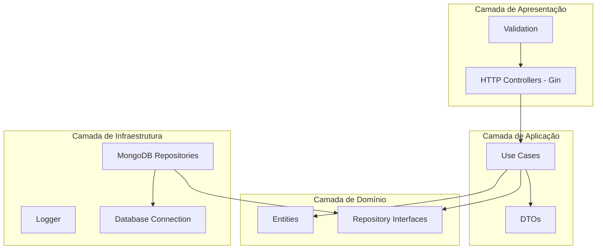
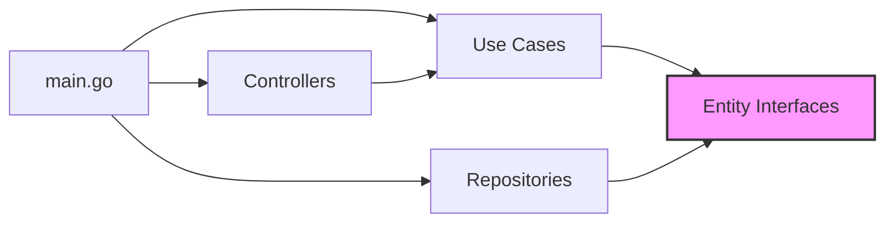

# Arquitetura do Sistema de Leilão

## Visão Geral

O sistema segue os princípios da **Clean Architecture**, separando responsabilidades em camadas bem definidas que permitem alta testabilidade, manutenibilidade e independência de frameworks externos.

## Diagrama de Camadas



## Estrutura de Diretórios

```
├── cmd/
│   └── auction/
│       └── main.go              # Ponto de entrada, injeção de dependências
│
├── configuration/
│   ├── database/mongodb/        # Conexão com MongoDB
│   ├── logger/                  # Logger estruturado (Zap)
│   └── rest_err/                # Padronização de erros REST
│
├── internal/
│   ├── entity/                  # Entidades de Domínio
│   │   ├── auction_entity/      # Leilão
│   │   ├── bid_entity/          # Lance
│   │   └── user_entity/         # Usuário
│   │
│   ├── infra/
│   │   ├── api/web/
│   │   │   ├── controller/      # Controladores HTTP
│   │   │   └── validation/      # Validação de requests
│   │   │
│   │   └── database/            # Implementação dos repositórios
│   │       ├── auction/
│   │       ├── bid/
│   │       └── user/
│   │
│   ├── internal_error/          # Tipos de erro internos
│   │
│   └── usecase/                 # Casos de uso
│       ├── auction_usecase/
│       ├── bid_usecase/
│       └── user_usecase/
│
└── doc/                         # Documentação
```

## Camadas da Arquitetura

### 1. Camada de Domínio (Entities)

A camada mais interna contém as **entidades de negócio** e suas regras:

| Entidade | Arquivo | Responsabilidade |
|----------|---------|------------------|
| `Auction` | `auction_entity.go` | Leilão com validação, estados e interface do repositório |
| `Bid` | `bid_entity.go` | Lance com validação e interface do repositório |
| `User` | `user_entity.go` | Usuário e interface do repositório |

**Características:**
- Entidades são independentes de frameworks
- Contêm regras de validação de negócio
- Definem interfaces que devem ser implementadas pela infraestrutura

### 2. Camada de Aplicação (Use Cases)

Orquestra o fluxo de dados entre entidades e infraestrutura:

| Use Case | Responsabilidade |
|----------|------------------|
| `AuctionUseCase` | Criar, buscar leilões e determinar vencedor |
| `BidUseCase` | Criar e buscar lances |
| `UserUseCase` | Buscar usuários |

**DTOs (Data Transfer Objects):**
- `AuctionInputDTO` / `AuctionOutputDTO`
- `BidInputDTO` / `BidOutputDTO`
- `WinningInfoOutputDTO`

### 3. Camada de Infraestrutura

Implementações concretas das interfaces:

| Componente | Tecnologia | Responsabilidade |
|------------|------------|------------------|
| Repositories | MongoDB | Persistência de dados |
| Controllers | Gin | Roteamento e serialização HTTP |
| Logger | Zap | Logs estruturados |

### 4. Camada de Apresentação (Controllers)

Recebe requisições HTTP e delega para os use cases:

- `AuctionController` - Endpoints de leilão
- `BidController` - Endpoints de lance
- `UserController` - Endpoints de usuário

## Fluxo de Dependências



A regra de dependência diz que camadas externas podem depender de camadas internas, mas nunca o contrário. As **interfaces definidas nas entidades** permitem que os use cases não dependam diretamente das implementações de infraestrutura.

## Inversão de Dependência

O padrão é aplicado através de:

1. **Interfaces nas Entidades:**
   ```go
   type AuctionRepositoryInterface interface {
       CreateAuction(ctx context.Context, auction *Auction) *internal_error.InternalError
       FindAuctions(...) ([]Auction, *internal_error.InternalError)
       FindAuctionById(ctx context.Context, id string) (*Auction, *internal_error.InternalError)
   }
   ```

2. **Injeção de Dependências no main.go:**
   ```go
   auctionRepository := auction.NewAuctionRepository(database)
   auctionController := auction_controller.NewAuctionController(
       auction_usecase.NewAuctionUseCase(auctionRepository, bidRepository))
   ```

## Tratamento de Erros

O sistema utiliza um padrão centralizado de erros:

| Tipo | HTTP Status | Uso |
|------|-------------|-----|
| `BadRequestError` | 400 | Validação de entrada |
| `NotFoundError` | 404 | Recurso não encontrado |
| `InternalServerError` | 500 | Erros internos |

## Concorrência

O repositório de lances (`BidRepository`) implementa **processamento concorrente** usando:

- `sync.WaitGroup` para sincronização de goroutines
- `sync.Mutex` para proteção de mapas compartilhados
- Cache em memória para status e tempo de expiração de leilões

Veja [DATA_FLOW.md](DATA_FLOW.md) para detalhes do fluxo de criação de lances.
