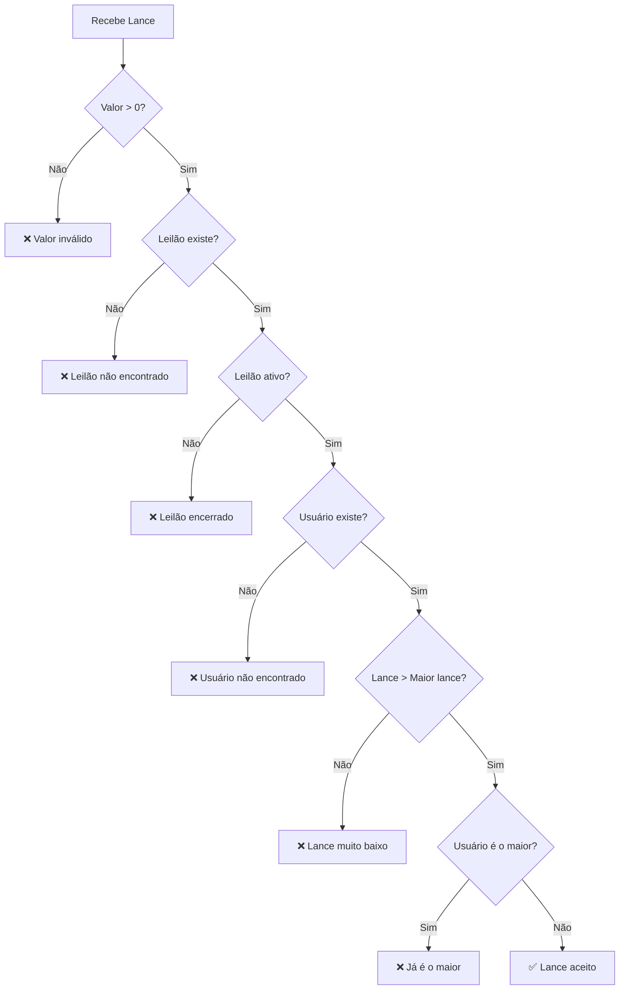

# Business Rules - Auction System

Este documento descreve as regras de negócio do sistema de leilões.

## Leilões (Auctions)

### Criação de Leilão

| Campo | Regra | Mensagem de Erro |
|-------|-------|------------------|
| `product_name` | Obrigatório, mínimo 1 caractere | "product_name is required" |
| `category` | Obrigatório, mínimo 2 caracteres | "category is required" |
| `description` | Obrigatório, 10-200 caracteres | "description must be between 10 and 200 characters" |
| `condition` | Valores: 0 (Novo), 1 (Usado), 2 (Recondicionado) | "condition must be 0, 1, or 2" |

### Status do Leilão

| Status | Código | Descrição |
|--------|--------|-----------|
| Active | 0 | Leilão ativo, aceita lances |
| Completed | 1 | Leilão finalizado |

### Expiração Automática

O leilão expira automaticamente após o tempo definido na variável de ambiente `AUCTION_INTERVAL` (padrão: 5 minutos).

**Campos de data:**
- `CreatedAt` - Data de criação do leilão
- `ExpiresAt` - Data de expiração (calculada automaticamente: `CreatedAt + AUCTION_INTERVAL`)

**Goroutine de fechamento:**
Uma goroutine roda em background verificando leilões expirados a cada `AUCTION_CLOSE_CHECK_INTERVAL` (padrão: 10s) e atualizando o status para `Completed`.

---

## Lances (Bids)

### Regras de Validação

| # | Regra | Mensagem de Erro |
|---|-------|------------------|
| 1 | Valor do lance deve ser maior que zero | "Amount is not a valid value" |
| 2 | O leilão deve existir | "Auction not found" |
| 3 | O leilão deve estar ativo | "Auction is no longer active" |
| 4 | O usuário deve existir | "User not found" |
| 5 | O lance deve ser **maior** que o lance atual mais alto | "Bid must be higher than current highest bid" |
| 6 | O usuário não pode dar lance se já é o maior* | "You are already the highest bidder" |

> *Regra 6 pode ser desabilitada via `ALLOW_SELF_OUTBID=true`

### Diagrama de Validação



### Processamento em Lote

Para otimizar performance, os lances são processados em lote:

| Configuração | Variável de Ambiente | Padrão |
|--------------|---------------------|--------|
| Tamanho do lote | `MAX_BATCH_SIZE` | 5 |
| Intervalo de inserção | `BATCH_INSERT_INTERVAL` | 3m |

---

## Usuários (Users)

### Consulta de Usuário

- O `userId` deve ser um UUID válido
- Retorna 404 se o usuário não for encontrado

---

## Lance Vencedor

O lance vencedor é determinado pelo **maior valor** (`amount`) entre todos os lances de um leilão.

```sql
-- Lógica equivalente
SELECT * FROM bids 
WHERE auction_id = ? 
ORDER BY amount DESC 
LIMIT 1
```

---

## Variáveis de Ambiente

| Variável | Descrição | Padrão |
|----------|-----------|--------|
| `MONGODB_HOST` | Host do MongoDB | localhost |
| `MONGODB_PORT` | Porta do MongoDB | 27017 |
| `MONGODB_USER` | Usuário do MongoDB | - |
| `MONGODB_PASSWORD` | Senha do MongoDB | - |
| `MONGODB_DB` | Nome do banco de dados | auctions |
| `AUCTION_INTERVAL` | Duração do leilão | 5m |
| `AUCTION_CLOSE_CHECK_INTERVAL` | Intervalo de verificação de leilões expirados | 10s |
| `BATCH_INSERT_INTERVAL` | Intervalo de processamento de lances | 3m |
| `MAX_BATCH_SIZE` | Tamanho máximo do lote de lances | 5 |
| `ALLOW_SELF_OUTBID` | Permite lances consecutivos do mesmo usuário | false |
