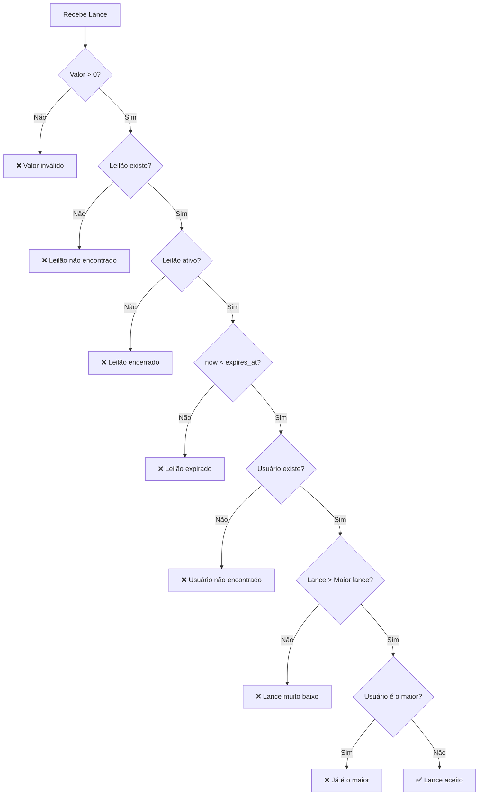

# Business Rules - Auction System

Este documento descreve as regras de negócio do sistema de leilões.

## Leilões (Auctions)

### Criação de Leilão

| Campo | Regra | Mensagem de Erro |
|-------|-------|------------------|
| `product_name` | Obrigatório, mínimo 1 caractere | "product_name is required" |
| `category` | Obrigatório, mínimo 2 caracteres | "category is required" |
| `description` | Obrigatório, 10-200 caracteres | "description must be between 10 and 200 characters" |
| `condition` | Valores: 0 (Novo), 1 (Usado), 2 (Recondicionado) | "condition must be 0, 1, or 2" |

### Status do Leilão

| Status | Código | Descrição |
|--------|--------|-----------|
| Active | 0 | Leilão ativo, aceita lances |
| Completed | 1 | Leilão finalizado |

### Campos de Data e Expiração

| Campo | Descrição |
|-------|-----------|
| `CreatedAt` | Data/hora de criação do leilão |
| `ExpiresAt` | Data/hora de expiração (calculada: `CreatedAt + AUCTION_INTERVAL`) |

O leilão expira automaticamente após o tempo definido na variável de ambiente `AUCTION_INTERVAL` (padrão: 5 minutos).

---

## ⏱️ Fechamento Automático de Leilões

O sistema implementa **dois mecanismos complementares** para garantir que leilões expirados não aceitem mais lances:

### 1. Goroutine de Fechamento em Background

Uma goroutine roda em background verificando leilões expirados:

| Configuração | Variável de Ambiente | Padrão |
|--------------|---------------------|--------|
| Intervalo de verificação | `AUCTION_CLOSE_CHECK_INTERVAL` | 10s |

**Comportamento:**
- Executa em loop infinito a cada intervalo configurado
- Busca leilões com `status=Active` **E** `expires_at <= now`
- Atualiza o status para `Completed` via `UpdateMany`
- Iniciada automaticamente no startup da aplicação (`main.go`)

```go
// Localização: internal/infra/database/auction/close_auction.go
func (ar *AuctionRepository) StartAuctionCloserRoutine(ctx context.Context) {
    ticker := time.NewTicker(interval)
    go func() {
        for {
            select {
            case <-ctx.Done():
                return
            case <-ticker.C:
                ar.closeExpiredAuctions(ctx)
            }
        }
    }()
}
```

### 2. Validação em Tempo Real (Rejeição de Lances)

**Importante:** Lances são rejeitados **imediatamente** quando o leilão expirou, **mesmo antes** da goroutine de fechamento atualizar o status para `Completed`.

```
┌─────────────────────────────────────────────────────────────────┐
│              Validação de Lance em Tempo Real                   │
├─────────────────────────────────────────────────────────────────┤
│  Ao receber um lance, o BidRepository verifica:                 │
│                                                                 │
│  1. Status do leilão em cache (ou busca no DB)                  │
│  2. Campo expires_at vs time.Now()                              │
│                                                                 │
│  if status == Completed || now.After(auctionEndTime) {          │
│      return // Lance rejeitado                                  │
│  }                                                              │
│                                                                 │
│  Isso garante que NENHUM lance é aceito após expires_at,        │
│  independente do intervalo da goroutine de fechamento.          │
└─────────────────────────────────────────────────────────────────┘
```

**Código relevante** (`internal/infra/database/bid/create_bid.go`):

```go
if okEndTime && okStatus {
    now := time.Now()
    // Rejeita se completado OU se já passou de expires_at
    if auctionStatus == auction_entity.Completed || now.After(auctionEndTime) {
        return // Lance ignorado
    }
    // ... processa o lance
}
```

### Diagrama: Por que a validação dupla é necessária?

```
Tempo:    12:00:00        12:00:05        12:00:10
              │               │               │
              ▼               ▼               ▼
          Leilão         Lance          Goroutine
          expira       recebido          executa
              │               │               │
              │               │               │
              │      ┌────────┴────────┐      │
              │      │ Validação:      │      │
              │      │ now > expires_at│      │
              │      │ → REJEITADO     │      │
              │      └─────────────────┘      │
              │                               │
              │                        ┌──────┴──────┐
              │                        │ UpdateMany  │
              │                        │ status=1    │
              │                        └─────────────┘
```

**Conclusão:** A validação em tempo real garante **zero lances após expiração**, mesmo que a goroutine de fechamento execute apenas periodicamente.

---

## Lances (Bids)

### Regras de Validação

| # | Regra | Mensagem de Erro |
|---|-------|------------------|
| 1 | Valor do lance deve ser maior que zero | "Amount is not a valid value" |
| 2 | O leilão deve existir | "Auction not found" |
| 3 | O leilão deve estar ativo (`status != Completed`) | "Auction is no longer active" |
| 4 | O leilão não pode estar expirado (`now < expires_at`) | Lance ignorado silenciosamente |
| 5 | O usuário deve existir | "User not found" |
| 6 | O lance deve ser **maior** que o lance atual mais alto | "Bid must be higher than current highest bid" |
| 7 | O usuário não pode dar lance se já é o maior* | "You are already the highest bidder" |

> *Regra 7 pode ser desabilitada via `ALLOW_SELF_OUTBID=true`

### Diagrama de Validação



### Processamento em Lote

Para otimizar performance, os lances são processados em lote:

| Configuração | Variável de Ambiente | Padrão |
|--------------|---------------------|--------|
| Tamanho do lote | `MAX_BATCH_SIZE` | 5 |
| Intervalo de inserção | `BATCH_INSERT_INTERVAL` | 3m |

---

## Usuários (Users)

### Consulta de Usuário

- O `userId` deve ser um UUID válido
- Retorna 404 se o usuário não for encontrado

---

## Lance Vencedor

O lance vencedor é determinado pelo **maior valor** (`amount`) entre todos os lances de um leilão.

```sql
-- Lógica equivalente
SELECT * FROM bids 
WHERE auction_id = ? 
ORDER BY amount DESC 
LIMIT 1
```

---

## Variáveis de Ambiente

O arquivo `.env` deve estar na **raiz do projeto**.

| Variável | Descrição | Padrão |
|----------|-----------|--------|
| `MONGODB_HOST` | Host do MongoDB | localhost |
| `MONGODB_PORT` | Porta do MongoDB | 27017 |
| `MONGODB_USER` | Usuário do MongoDB | - |
| `MONGODB_PASSWORD` | Senha do MongoDB | - |
| `MONGODB_DB` | Nome do banco de dados | auctions |
| `AUCTION_INTERVAL` | Duração do leilão após criação | 5m |
| `AUCTION_CLOSE_CHECK_INTERVAL` | Intervalo de verificação de leilões expirados | 10s |
| `BATCH_INSERT_INTERVAL` | Intervalo de processamento de lances | 3m |
| `MAX_BATCH_SIZE` | Tamanho máximo do lote de lances | 5 |
| `ALLOW_SELF_OUTBID` | Permite lances consecutivos do mesmo usuário | false |
