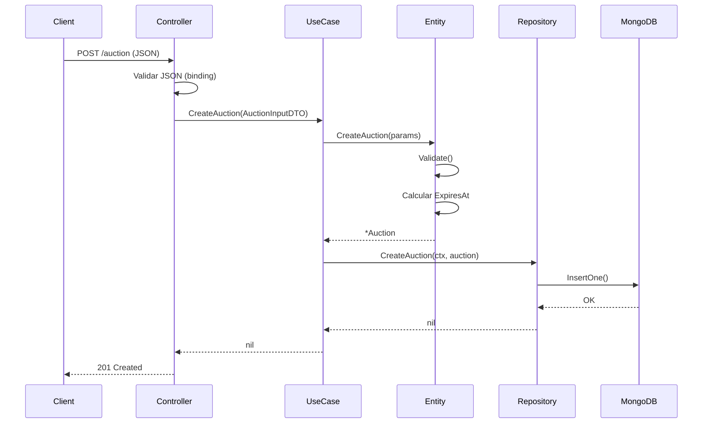
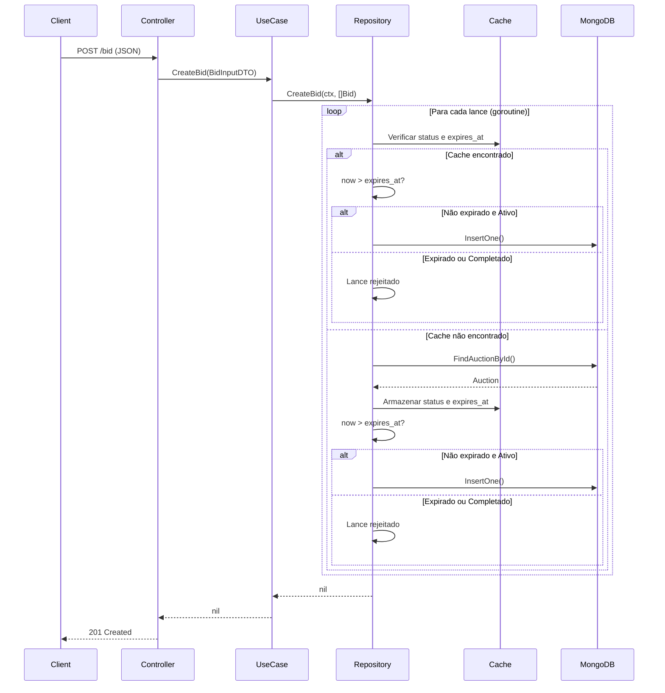
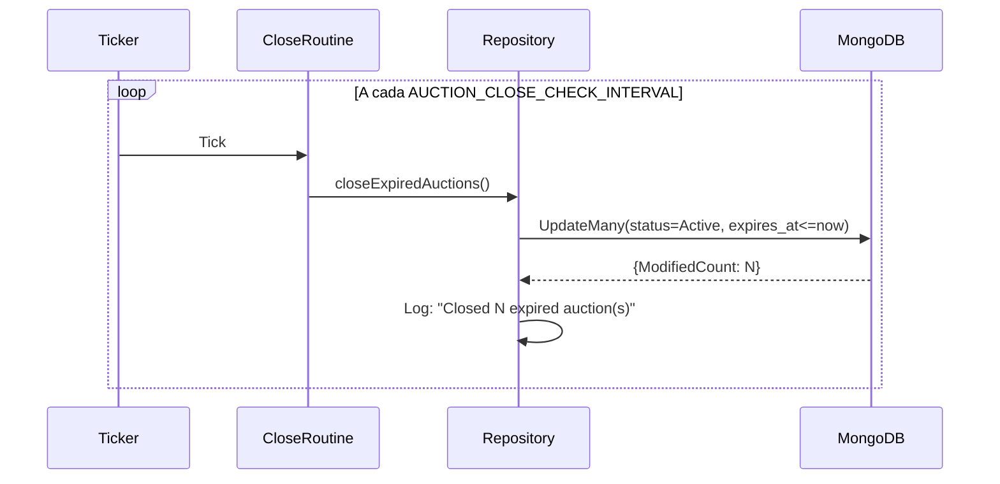
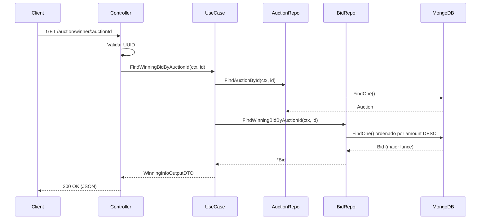
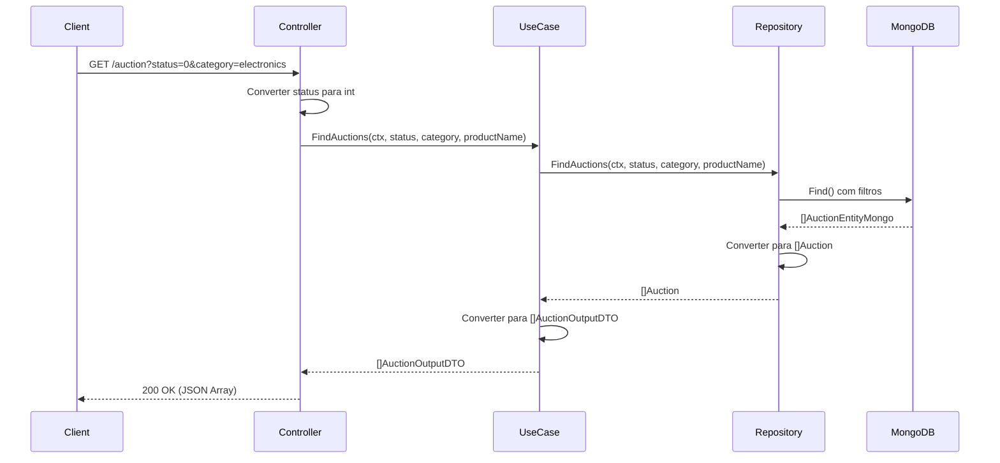

# Fluxo de Dados

Este documento descreve os principais fluxos de dados do sistema de leilão.

## Criar Leilão



### Validações

1. **Controller (binding):**
   - `product_name`: obrigatório, mínimo 1 caractere
   - `category`: obrigatório, mínimo 2 caracteres
   - `description`: obrigatório, 10-200 caracteres
   - `condition`: deve ser 0, 1 ou 2

2. **Entity:**
   - Valida regras de negócio adicionais
   - Gera UUID e timestamp automaticamente
   - Calcula `ExpiresAt = CreatedAt + AUCTION_INTERVAL`

---

## Criar Lance (com Concorrência e Validação de Expiração)

O sistema de lances implementa processamento concorrente com controle de expiração em tempo real:



### Controle de Concorrência

O `BidRepository` mantém dois mapas protegidos por mutex:

| Mapa | Proteção | Finalidade |
|------|----------|------------|
| `auctionStatusMap` | `auctionStatusMapMutex` | Cache do status do leilão |
| `auctionEndTimeMap` | `auctionEndTimeMutex` | Cache do campo `expires_at` |

### Validação de Expiração em Tempo Real

```go
// Código em create_bid.go
if okEndTime && okStatus {
    now := time.Now()
    // Rejeita se status=Completed OU se já passou de expires_at
    if auctionStatus == auction_entity.Completed || now.After(auctionEndTime) {
        return // Lance ignorado
    }
    // ... insere o lance
}
```

**Importante:** Esta validação garante que lances são rejeitados **imediatamente** após `expires_at`, mesmo **antes** da goroutine de fechamento atualizar o status para `Completed`.

---

## Fechamento Automático de Leilões



### Configuração

| Variável | Descrição | Padrão |
|----------|-----------|--------|
| `AUCTION_CLOSE_CHECK_INTERVAL` | Intervalo entre verificações | 10s |

---

## Buscar Lance Vencedor



---

## Listar Leilões com Filtros



### Filtros Disponíveis

| Query Param | Tipo | Descrição |
|-------------|------|-----------|
| `status` | int | 0 = Ativo, 1 = Completado |
| `category` | string | Filtro por categoria |
| `productName` | string | Filtro por nome do produto |

---

## Transformação de Dados

### Entity → MongoDB Document

```go
// Auction Entity
type Auction struct {
    Id          string
    ProductName string
    CreatedAt   time.Time  // Go time
    ExpiresAt   time.Time  // Go time
}

// MongoDB Document
type AuctionEntityMongo struct {
    Id          string `bson:"_id"`
    ProductName string `bson:"product_name"`
    CreatedAt   int64  `bson:"created_at"`   // Unix timestamp
    ExpiresAt   int64  `bson:"expires_at"`   // Unix timestamp
}
```

### Entity → DTO (Output)

```go
// Auction Entity
type Auction struct {
    Id          string
    Condition   ProductCondition  // entity type
    Status      AuctionStatus     // entity type
    CreatedAt   time.Time
    ExpiresAt   time.Time
}

// Output DTO
type AuctionOutputDTO struct {
    Id          string           `json:"id"`
    Condition   ProductCondition `json:"condition"`   // usecase type (int64)
    Status      AuctionStatus    `json:"status"`      // usecase type (int64)
    CreatedAt   time.Time        `json:"created_at"`
    ExpiresAt   time.Time        `json:"expires_at"`
}
```

As conversões de tipo entre camadas garantem o desacoplamento e permitem diferentes representações para cada contexto.

---

## Fluxo de Expiração: Timeline

```
Tempo:        T+0           T+20s         T+25s         T+30s
               │              │             │             │
               ▼              ▼             ▼             ▼
            Leilão        Leilão        Lance         Goroutine
            criado        expira       recebido       executa
               │              │             │             │
               │              │             │             │
               │              │    ┌────────┴────────┐    │
               │              │    │ BidRepository:  │    │
               │              │    │ now > expires_at│    │
               │              │    │ → REJEITADO     │    │
               │              │    └─────────────────┘    │
               │              │                           │
               │              │                    ┌──────┴──────┐
               │              │                    │ UpdateMany  │
               │              │                    │ status=1    │
               │              │                    └─────────────┘
```

Este fluxo demonstra que a validação em tempo real (`now > expires_at`) rejeita lances **antes** da goroutine de fechamento executar, garantindo integridade total.
