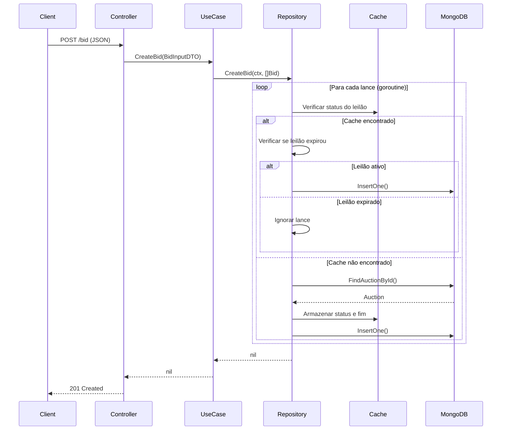

# Fluxo de Dados

Este documento descreve os principais fluxos de dados do sistema de leilão.

## Criar Leilão


### Validações

1. **Controller (binding):**
   - `product_name`: obrigatório, mínimo 1 caractere
   - `category`: obrigatório, mínimo 2 caracteres
   - `description`: obrigatório, 10-200 caracteres
   - `condition`: deve ser 0, 1 ou 2

2. **Entity:**
   - Valida regras de negócio adicionais
   - Gera UUID e timestamp automaticamente

---

## Criar Lance (com Concorrência)

O sistema de lances implementa processamento concorrente com controle de expiração:



### Controle de Concorrência

O `BidRepository` mantém dois mapas protegidos por mutex:

| Mapa | Proteção | Finalidade |
|------|----------|------------|
| `auctionStatusMap` | `auctionStatusMapMutex` | Cache do status do leilão |
| `auctionEndTimeMap` | `auctionEndTimeMutex` | Cache do tempo de expiração |

### Tempo de Expiração

```go
auctionEndTime = auction.Timestamp.Add(auctionInterval)
```

A duração do leilão (`AUCTION_INTERVAL`) é configurável via variável de ambiente, com padrão de 5 minutos.

---

## Buscar Lance Vencedor


---

## Listar Leilões com Filtros


### Filtros Disponíveis

| Query Param | Tipo | Descrição |
|-------------|------|-----------|
| `status` | int | 0 = Ativo, 1 = Completado |
| `category` | string | Filtro por categoria |
| `productName` | string | Filtro por nome do produto |

---

## Transformação de Dados

### Entity → MongoDB Document

```go
// Auction Entity
type Auction struct {
    Id          string
    ProductName string
    Timestamp   time.Time  // Go time
}

// MongoDB Document
type AuctionEntityMongo struct {
    Id          string `bson:"_id"`
    ProductName string `bson:"product_name"`
    Timestamp   int64  `bson:"timestamp"`  // Unix timestamp
}
```

### Entity → DTO (Output)

```go
// Auction Entity
type Auction struct {
    Id          string
    Condition   ProductCondition  // entity type
    Status      AuctionStatus     // entity type
}

// Output DTO
type AuctionOutputDTO struct {
    Id          string           `json:"id"`
    Condition   ProductCondition `json:"condition"`   // usecase type (int64)
    Status      AuctionStatus    `json:"status"`      // usecase type (int64)
}
```

As conversões de tipo entre camadas garantem o desacoplamento e permitem diferentes representações para cada contexto.
