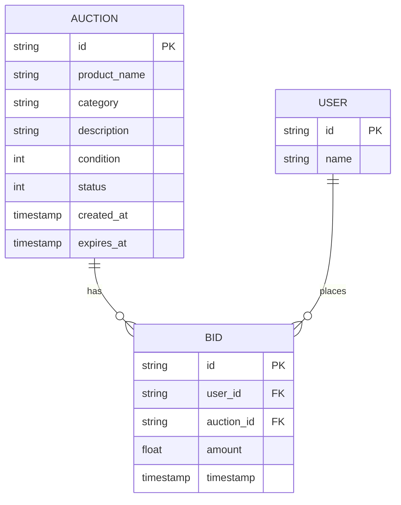

# Modelo de Entidades

Este documento descreve as entidades de domínio do sistema de leilão.

## Diagrama de Entidades



---

## Auction (Leilão)

Representa um leilão no sistema.

### Estrutura

```go
type Auction struct {
    Id          string           // UUID único
    ProductName string           // Nome do produto
    Category    string           // Categoria (ex: "electronics")
    Description string           // Descrição detalhada
    Condition   ProductCondition // Estado do produto
    Status      AuctionStatus    // Status do leilão
    CreatedAt   time.Time        // Data/hora de criação
    ExpiresAt   time.Time        // Data/hora de expiração
}
```

### Campos de Data

| Campo | Descrição |
|-------|-----------|
| `CreatedAt` | Data/hora em que o leilão foi criado |
| `ExpiresAt` | Data/hora de expiração, calculada como `CreatedAt + AUCTION_INTERVAL` |

### ProductCondition (Condição do Produto)

| Valor | Constante | Descrição |
|-------|-----------|-----------|
| 1 | `New` | Produto novo |
| 2 | `Used` | Produto usado |
| 3 | `Refurbished` | Produto recondicionado |

### AuctionStatus (Status do Leilão)

| Valor | Constante | Descrição |
|-------|-----------|-----------|
| 0 | `Active` | Leilão em andamento |
| 1 | `Completed` | Leilão finalizado |

### Regras de Validação

```go
func (au *Auction) Validate() *internal_error.InternalError {
    // ProductName: mínimo 2 caracteres
    // Category: mínimo 3 caracteres  
    // Description: mínimo 11 caracteres
    // Condition: deve ser New, Used ou Refurbished
}
```

### Coleção MongoDB

**Nome:** `auctions`

```json
{
    "_id": "uuid-string",
    "product_name": "iPhone 15 Pro",
    "category": "electronics",
    "description": "Novo na caixa lacrada",
    "condition": 1,
    "status": 0,
    "created_at": 1703260000,
    "expires_at": 1703260300
}
```

---

## Bid (Lance)

Representa um lance em um leilão.

### Estrutura

```go
type Bid struct {
    Id        string    // UUID único
    UserId    string    // ID do usuário que deu o lance
    AuctionId string    // ID do leilão
    Amount    float64   // Valor do lance
    Timestamp time.Time // Data/hora do lance
}
```

### Regras de Validação

```go
func (b *Bid) Validate() *internal_error.InternalError {
    // UserId: deve ser UUID válido
    // AuctionId: deve ser UUID válido
    // Amount: deve ser maior que 0
}
```

### Regras de Negócio

1. **Lance só aceito em leilão ativo:**
   - Verifica se `status == Active`
   - Verifica se tempo atual < `expires_at`

2. **Validação de expiração em tempo real:**
   ```go
   // Mesmo antes da goroutine de fechamento atualizar o status,
   // lances são rejeitados se now > expires_at
   if auctionStatus == Completed || now.After(auctionEndTime) {
       return // Lance rejeitado
   }
   ```

### Coleção MongoDB

**Nome:** `bids`

```json
{
    "_id": "uuid-string",
    "user_id": "user-uuid",
    "auction_id": "auction-uuid",
    "amount": 5000.50,
    "timestamp": 1703260100
}
```

### Lance Vencedor

O lance vencedor é determinado pelo **maior valor** (`Amount`):

```go
// Ordenação: amount descrescente, retorna primeiro
opts := options.FindOne().SetSort(bson.D{{"amount", -1}})
```

---

## User (Usuário)

Representa um usuário do sistema.

### Estrutura

```go
type User struct {
    Id   string // UUID único
    Name string // Nome do usuário
}
```

### Coleção MongoDB

**Nome:** `users`

```json
{
    "_id": "uuid-string",
    "name": "João Silva"
}
```

---

## Interfaces de Repositório

Cada entidade define uma interface que deve ser implementada pela camada de infraestrutura:

### AuctionRepositoryInterface

```go
type AuctionRepositoryInterface interface {
    CreateAuction(ctx context.Context, auction *Auction) *internal_error.InternalError
    FindAuctions(ctx context.Context, status AuctionStatus, category, productName string) ([]Auction, *internal_error.InternalError)
    FindAuctionById(ctx context.Context, id string) (*Auction, *internal_error.InternalError)
}
```

### BidEntityRepository

```go
type BidEntityRepository interface {
    CreateBid(ctx context.Context, bids []Bid) *internal_error.InternalError
    FindBidByAuctionId(ctx context.Context, auctionId string) ([]Bid, *internal_error.InternalError)
    FindWinningBidByAuctionId(ctx context.Context, auctionId string) (*Bid, *internal_error.InternalError)
}
```

### UserRepositoryInterface

```go
type UserRepositoryInterface interface {
    FindUserById(ctx context.Context, userId string) (*User, *internal_error.InternalError)
}
```

---

## DTOs (Data Transfer Objects)

### AuctionInputDTO

```go
type AuctionInputDTO struct {
    ProductName string           `json:"product_name" binding:"required,min=1"`
    Category    string           `json:"category" binding:"required,min=2"`
    Description string           `json:"description" binding:"required,min=10,max=200"`
    Condition   ProductCondition `json:"condition" binding:"oneof=0 1 2"`
}
```

### AuctionOutputDTO

```go
type AuctionOutputDTO struct {
    Id          string           `json:"id"`
    ProductName string           `json:"product_name"`
    Category    string           `json:"category"`
    Description string           `json:"description"`
    Condition   ProductCondition `json:"condition"`
    Status      AuctionStatus    `json:"status"`
    CreatedAt   time.Time        `json:"created_at"`
    ExpiresAt   time.Time        `json:"expires_at"`
}
```

### BidOutputDTO

```go
type BidOutputDTO struct {
    Id        string    `json:"id"`
    UserId    string    `json:"user_id"`
    AuctionId string    `json:"auction_id"`
    Amount    float64   `json:"amount"`
    Timestamp time.Time `json:"timestamp"`
}
```

### WinningInfoOutputDTO

```go
type WinningInfoOutputDTO struct {
    Auction AuctionOutputDTO `json:"auction"`
    Bid     *BidOutputDTO    `json:"bid,omitempty"`
}
```

---

## Configuração

O arquivo `.env` deve estar na **raiz do projeto**. Principais variáveis relacionadas a entidades:

| Variável | Descrição | Padrão |
|----------|-----------|--------|
| `AUCTION_INTERVAL` | Tempo de duração do leilão | 5m |
| `AUCTION_CLOSE_CHECK_INTERVAL` | Intervalo de verificação de leilões expirados | 10s |
